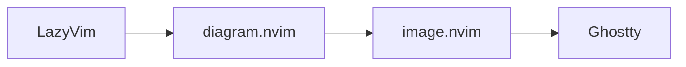

# dotfiles

Personal Ubuntu development environment focused on terminal productivity, reproducible toolchains, and a lightweight Neovim setup.

## Stack

### Terminal

* Ghostty
* Fish
* tmux

### CLI

* eza
* bat / batcat
* fd
* ripgrep
* fzf
* GitHub CLI

### Runtime and package management

* mise
* pnpm
* uv
* Python
* Node.js

### Editor

* Neovim
* LazyVim
* lazy.nvim
* Treesitter
* render-markdown.nvim
* diagram.nvim
* image.nvim

## Structure

```text
.
├── bat/
│   └── config
├── fish/
│   ├── conf.d/
│   │   ├── aliases.fish
│   │   ├── env.fish
│   │   └── fzf.fish
│   ├── functions/
│   │   ├── dots-help.fish
│   │   ├── fcd.fish
│   │   ├── ff.fish
│   │   ├── fg.fish
│   │   ├── fglog.fish
│   │   ├── fr.fish
│   │   └── fv.fish
│   └── config.fish
├── ghostty/
│   └── config.ghostty
├── nvim/
│   └── ...
├── ripgrep/
│   └── ripgreprc
├── mermaid/
│   └── puppeteer.json
└── .tmux.conf
```

## Useful commands

```text
ff      find file + preview + open in Neovim
fv      find file + preview with bat
fcd     find directory + cd
fg      find Git-tracked file
fr      search file contents + jump to exact line
fglog   browse Git commits with fzf and preview diffs

dots-help
        show the full dotfiles command reference
```

## Toolchains

Runtime versions are managed with `mise`.

Example:

```fish
mise use -g node@22
mise use -g pnpm@latest
mise use -g python@3.13
mise use -g uv@latest
```

Check installed tools:

```fish
mise current
```

### pnpm

The pnpm global binary directory is added to Fish's `PATH`.

```fish
set -Ux PNPM_HOME $HOME/.local/share/pnpm
fish_add_path $PNPM_HOME/bin
```

Global CLI tools can then be installed with:

```fish
pnpm add -g <package>
```

### Python

Python is managed by `mise`, while Python projects and CLI environments are managed with `uv`.

Example project:

```fish
uv init my-project
cd my-project

uv python pin 3.13
uv add numpy pandas jupyter
uv run python main.py
```

## Neovim

The Neovim configuration is based on LazyVim and `lazy.nvim`.

Custom plugin specs live under:

```text
~/.config/nvim/lua/plugins/
```

Plugin specification files must use the `.lua` extension.

For example:

```text
lua/plugins/markdown.lua
lua/plugins/diagram.lua
```

### lazy.nvim and LuaRocks

LuaRocks support is disabled because the current image rendering setup uses ImageMagick's CLI and does not require Lua rocks.

```lua
require("lazy").setup({
  -- ...

  rocks = {
    enabled = false,
  },
})
```

This also avoids `hererocks` trying to build a separate Lua 5.1 environment for `image.nvim`.

## Markdown

Markdown rendering is provided by `render-markdown.nvim`.

Treesitter parsers used by the setup include:

```text
markdown
markdown_inline
html
latex
yaml
```

### Treesitter CLI

Some Treesitter parsers require `tree-sitter-cli`.

It is installed globally with pnpm:

```fish
pnpm add -g tree-sitter-cli
```

Verify:

```fish
tree-sitter --version
```

Then parsers can be installed inside Neovim:

```vim
:TSInstall latex
```

Health checks:

```vim
:checkhealth nvim-treesitter
:checkhealth render-markdown
```

## LaTeX

`render-markdown.nvim` supports inline LaTeX rendering.

The Treesitter LaTeX parser is required:

```vim
:TSInstall latex
```

For LaTeX-to-text conversion, `latex2text` can be installed through Python tooling if needed.

## Mermaid diagrams

Mermaid diagrams inside Markdown are rendered using:

```text
Markdown
    ↓
diagram.nvim
    ↓
mmdc
    ↓
PNG
    ↓
image.nvim
    ↓
Kitty graphics protocol
    ↓
Ghostty
```

### Mermaid CLI

Install Mermaid CLI with pnpm:

```fish
pnpm add -g @mermaid-js/mermaid-cli
```

Verify:

```fish
mmdc --version
```

Example Mermaid block:

````markdown

````

### Puppeteer sandbox on Ubuntu

Recent Ubuntu versions may prevent Chromium/Puppeteer from starting its sandbox.

The local Mermaid Puppeteer configuration uses:

```json
{
  "args": ["--no-sandbox"]
}
```

The file is symlinked to:

```text
~/.config/mermaid/puppeteer.json
```

`diagram.nvim` passes it to `mmdc`:

```lua
renderer_options = {
  mermaid = {
    background = "transparent",
    theme = "dark",
    scale = 1,
    cli_args = {
      "-p",
      vim.fn.expand("~/.config/mermaid/puppeteer.json"),
    },
  },
}
```

Test Mermaid rendering outside Neovim:

```fish
echo 'flowchart LR; A[Start] --> B[Done]' > /tmp/test.mmd

mmdc \
  -p ~/.config/mermaid/puppeteer.json \
  -i /tmp/test.mmd \
  -o /tmp/test.png
```

## Image rendering

`diagram.nvim` uses `image.nvim` to display generated diagrams directly inside Neovim.

The current backend uses Ghostty's support for the Kitty graphics protocol:

```lua
{
  "3rd/image.nvim",
  lazy = false,
  opts = {
    backend = "kitty",
    processor = "magick_cli",
  },
}
```

ImageMagick is required:

```fish
sudo apt install imagemagick
```

Verify:

```fish
magick --version
```

A quick rendering test:

```fish
nvim /tmp/test.png
```

If `image.nvim` is working, Neovim should display the image instead of the raw PNG binary data.

## Health checks

Useful Neovim diagnostics:

```vim
:checkhealth
:checkhealth nvim-treesitter
:checkhealth render-markdown
:Lazy
```

## Notes

These dotfiles are symlinked from this repository into their expected locations under `$HOME` and `~/.config`.

The setup is intentionally small and focused on terminal productivity.

Runtime installation is kept separate from project dependencies:

```text
mise
├── Node.js
├── pnpm
├── Python
└── uv

uv
└── Python project environments

pnpm
└── Node.js CLI tools
```

The Neovim Markdown stack is designed to support rich terminal-native previews while keeping source files compatible with standard Markdown tooling such as GitHub.

