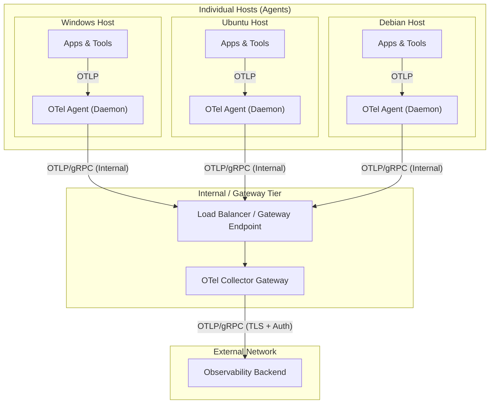

```mermaid
flowchart TB
    subgraph Hosts["Individual Hosts (Agents)"]
        subgraph HostWin["Windows Host"]
            WinApp["Apps & Tools"] -->|"OTLP"| WinAgent["OTel Agent (Daemon)"]
        end

        subgraph HostUbu["Ubuntu Host"]
            UbuApp["Apps & Tools"] -->|"OTLP"| UbuAgent["OTel Agent (Daemon)"]
        end

        subgraph HostDeb["Debian Host"]
            DebApp["Apps & Tools"] -->|"OTLP"| DebAgent["OTel Agent (Daemon)"]
        end
    end

    subgraph Cluster["Internal / Gateway Tier"]
        LB["Load Balancer / Gateway Endpoint"]
        Gateway["OTel Collector Gateway"]
        LB --> Gateway
    end

    subgraph External["External Network"]
        Backend["Observability Backend"]
    end

    WinAgent -->|"OTLP/gRPC (Internal)"| LB
    UbuAgent -->|"OTLP/gRPC (Internal)"| LB
    DebAgent -->|"OTLP/gRPC (Internal)"| LB

    Gateway -->|"OTLP/gRPC (TLS + Auth)"| Backend
```

